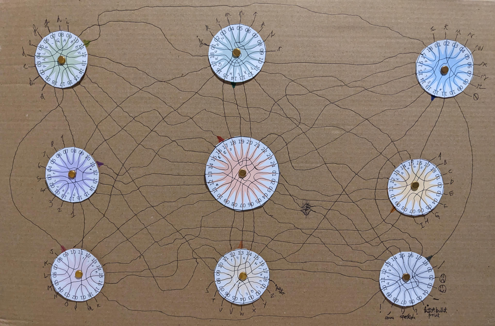

# Nonigma

The nine-wheeled cardboard enigma machine.

## Background

A family member designed this stunning cardboard enigma machine and so I decided to turn it into code so that the whole world could benefit from it's colourful encryption.



## Usage

The machine contains nine wheels. The eight around the edge have 18 connections each and can be interchanged with each other, while the central red wheel has 24 connections and joins onto the other eight. Around the edge of the machine are the letters and symbols. The machine works with the following 72-letter alphabet:

```
abcdefghijklmnopqrstuvwxyz0123456789ABCDEFGHIJKLMNOPQRSTUVWXYZ.!,'?*-🙂🙁/
```

The key for the machine consists of a sequence of colours and a sequence of numbers. The colours indicate which wheel to put in each slot (reading order - left to right and top to bottom) and the numbers indicate the initial position of each wheel. In the picture then the machine has been set with the key:

```
light green, dark green, blue, purple, red, orange, pink, peach, grey
11, 14, 12, 11, 17, 9, 9, 13, 0
```

If you have the correct colour of pens then this can be written more simply by writing each number in the appropriate colour. The middle wheel will always be red.

To encrypt a message then take each letter in turn and perform the following:
1. Follow the line from the letter's terminal until it reaches another letter's terminal. This is the encrypted letter.
2. If the two terminals are on different wheels then rotate each one notch anticlockwise.
3. If the two terminals are on the same wheel then rotate it one notch anticlockwise and also rotate the red wheel one notch anticlockwise.

Due to the symmetry of the process then decryption is identical to encryption.

## Example

Using the starting position shown in the image we can encrypt the word `Hello`.

* The `H` connects to `B`, so we turn the orange wheel one notch and the red wheel one notch.
* The `e` connects to `a`, so we turn the light green wheel one notch and the red wheel another notch.
* The `l` connects to `M`, so we turn the dark green and pink wheels one notch each.
* The `l` now connects to `p`, so we turn the dark green and red wheels.
* Finally the `o`connects to the `k` and we turn the dark green and red wheels again.

The encrypted message is therefore `BaMpk`. To decrypt this message simply set the machine back to the starting state and repeat all the steps.